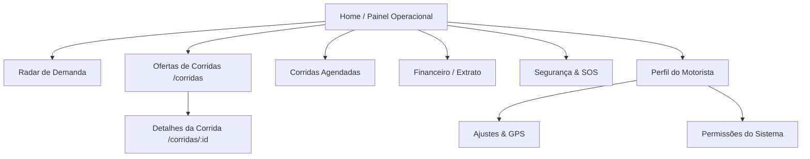

# Telas do Aplicativo do Motorista — SR Logística

> Especificação funcional e visual das telas do aplicativo do motorista.

---

## 1. Mapa de Navegação das Telas

---

## 2. Especificação das Telas Principais

### 1. Início / Painel Operacional (`/`)
- **Cabeçalho**: Saudação, status de conectividade, seletor de modo claro/escuro e notificações.
- **Controle de Status**: 3 modos de trabalho (`Disponível`, `Pausa`, `Offline`).
- **Cards de Operação**: Indicador de busca de corridas por pulso visual, `RideRequestCard` para chamadas recebidas e `ActiveRideCard` para corridas em trânsito.
- **Resumo do Dia**: Métricas rápidas de faturamento hoje, total de corridas e percentual da meta diária.

### 2. Tela de Corridas (`/corridas` e `/corridas/[id]`)
- **Lista de Ofertas**: Exibição de corridas disponíveis em tempo real com indicador de rentabilidade (R$/km e R$/hora), origem e destino.
- **Detalhes da Corrida (`/corridas/[id]`)**:
  - Resumo de valores com ganhos líquidos calculados.
  - Linha do tempo visual da rota com ícones de embarque (esmeralda) e desembarque (vermelho).
  - Informações completas do passageiro, telefone de contato e avaliação.
  - Modais integrados:
    - `QuickMessagesModal`: Mensagens prontas ("Estou a caminho", "Cheguei no local").
    - `FinishRideModal`: Finalização com validação de voucher corporativo ou foto de comprovante.

### 3. Radar de Demanda (`/radar`)
- **Mapa de Calor**: Visualização de zonas de alta demanda em Manaus (Centro, Adrianópolis, Ponta Negra, Vieiralves, etc.) com multiplicadores de tarifa dinâmica (ex: 1.4x, 1.6x).
- **Eventos e Polos de Concentração**: Eventos esportivos, shows e horários de pico.

### 4. Corridas Agendadas (`/agendadas`)
- Listagem organizada por data e horário de corridas pré-reservadas com valores garantidos.
- Modal para agendamento rápido de novas corridas corporativas.

### 5. Segurança & SOS (`/seguranca`)
- **Botão de Pânico SOS**: Acionamento em 1 toque que envia localização ao vivo para a central 24h e contatos de emergência.
- **Discagem Rápida**: Botões diretos para Polícia Militar (190) e SAMU (192).
- **Gestão de Contatos de Emergência**: Cadastro de familiares e amigos para monitoramento.

### 6. Financeiro & Extrato (`/(protected)/financeiro`)
- **Card de Saldo em Amarelo Dourado**: Destaque de saldo disponível com contraste alto (`text-slate-950`).
- **Ações Rápidas**: Botão para solicitação de saque instantâneo via PIX.
- **Extrato Detalhado**: Histórico completo de recebimentos por corrida, gorjetas e taxas.

### 7. Perfil e Ajustes (`/perfil` e `/ajustes`)
- Informações do condutor e do veículo cadastrado (modelo, placa Mercosul, cor e ano).
- Configuração do navegador GPS preferido (Waze ou Google Maps).
- Filtros automáticos de rentabilidade (auto-recusa por valor mínimo por km e nota mínima do passageiro).
